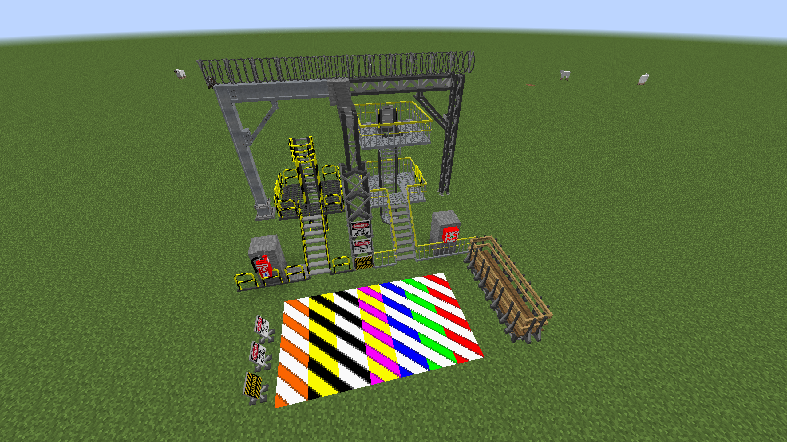

# Industrial Renewal Decor

A simple backport of decorative blocks from [Industrial Renewal](https://github.com/Cassiobsk8/Industrial_Renewal) to Minecraft 1.7.10 (GTNH).

Only decorative blocks are included — no machinery, energy, fluid or storage systems.



## Blocks

- Catwalks, catwalk stairs, ladders, hatches, and gates
- Handrails, pillars, columns, and braces (iron and steel variants)
- Platforms and frames
- Hazard blocks (caution, radiation, fire, safety, defective, aisle, block)
- Signs (high voltage, radioactive, caution)
- Fire extinguisher and first aid kit
- Razor wire

## Dependencies

- [GTNHLib](https://github.com/GTNewHorizons/GTNHLib) 0.9.37+

## Building

```bash
./gradlew build
```

## License

This work is a derivative of [Industrial Renewal](https://github.com/Cassiobsk8/Industrial_Renewal) by [Cassiobsk8](https://github.com/Cassiobsk8), licensed under [CC BY-NC-SA 4.0](https://creativecommons.org/licenses/by-nc-sa/4.0/).

This work is therefore also licensed under the [Creative Commons Attribution-NonCommercial-ShareAlike 4.0 International License](https://creativecommons.org/licenses/by-nc-sa/4.0/).

[](https://creativecommons.org/licenses/by-nc-sa/4.0/)
